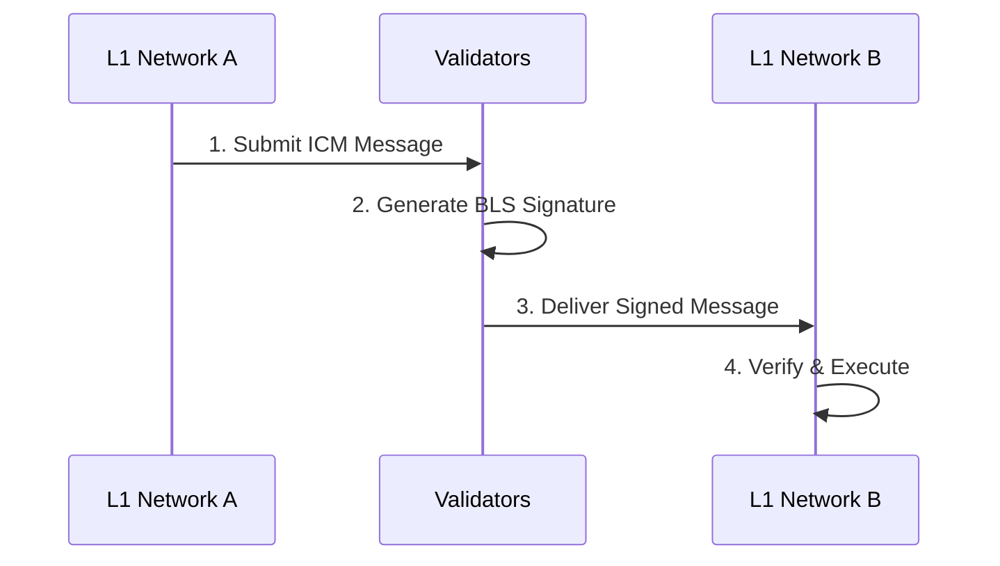

# Interchain Communication (ICM)

## What is ICM?

**Interchain Communication (ICM)** is Avalanche's native protocol for **cross-chain messaging** and **asset transfers** between L1 networks. ICM enables L1s to communicate with each other securely and efficiently, creating a truly interconnected blockchain ecosystem.

:::tip Think of ICM as...
**ICM is like the internet protocol for blockchains** - just as HTTP allows websites to communicate, ICM allows L1 networks to send messages, transfer assets, and coordinate actions across chains.
:::

## 🏗️ **ICM Architecture**

### **How ICM Works**



### **Core Components**

**1. Warp Messages**
- Cryptographically signed cross-chain messages
- Verified by validator signatures
- Contain payload data and routing information

**2. BLS Signatures**
- Boneh-Lynn-Shacham signature scheme
- Allows efficient signature aggregation
- Validators collectively sign messages

**3. Message Verification**
- Destination chain verifies signatures
- Ensures message authenticity
- Prevents replay attacks

## 📨 **Types of ICM Messages**

### **Asset Transfers**
Transfer tokens between L1 networks:

```solidity
// Example: Transfer USDC from L1A to L1B
function transferCrossChain(
    address destination,
    uint256 amount,
    bytes32 destinationChainID
) external {
    // Lock tokens on source chain
    _lockTokens(msg.sender, amount);

    // Send ICM message to destination
    _sendWarpMessage(
        destinationChainID,
        abi.encode(destination, amount)
    );
}
```

### **Contract Calls**
Execute functions on remote L1 networks:

```solidity
// Example: Call function on another L1
function crossChainCall(
    bytes32 targetChain,
    address targetContract,
    bytes calldata functionData
) external {
    _sendWarpMessage(
        targetChain,
        abi.encode(targetContract, functionData)
    );
}
```

### **State Synchronization**
Keep data synchronized across multiple L1s:

```solidity
// Example: Sync game state across gaming L1s
function syncGameState(
    bytes32[] memory targetChains,
    GameState memory state
) external {
    for (uint i = 0; i < targetChains.length; i++) {
        _sendWarpMessage(
            targetChains[i],
            abi.encode("UPDATE_STATE", state)
        );
    }
}
```

### **Governance Coordination**
Coordinate governance decisions across L1s:

```solidity
// Example: Multi-chain governance vote
function submitCrossChainProposal(
    bytes32[] memory governanceChains,
    Proposal memory proposal
) external {
    for (uint i = 0; i < governanceChains.length; i++) {
        _sendWarpMessage(
            governanceChains[i],
            abi.encode("GOVERNANCE_PROPOSAL", proposal)
        );
    }
}
```

## 🎯 **Real-World ICM Use Cases**

### **Gaming Ecosystems**
**Cross-Game Asset Interoperability**:
- Transfer in-game items between different games
- Unified player progression across multiple titles
- Cross-game tournaments and competitions

**Example**: Move a rare sword from GameA's L1 to GameB's L1

### **DeFi Protocols**
**Multi-Chain Liquidity**:
- Aggregate liquidity across multiple DeFi L1s
- Cross-chain lending and borrowing
- Unified yield farming strategies

**Example**: Lend USDC on DeFi L1A, borrow ETH on DeFi L1B

### **Enterprise Networks**
**Supply Chain Coordination**:
- Track products across multiple private L1s
- Coordinate between different company networks
- Maintain data consistency across subsidiaries

**Example**: Track a product from Manufacturing L1 → Logistics L1 → Retail L1

### **NFT & Media Platforms**
**Content Distribution**:
- Distribute content across multiple media L1s
- Cross-platform royalty payments
- Unified content verification

**Example**: Publish photo on Media L1A, automatically distribute to Gallery L1B

## 🔧 **Enabling ICM on L1 Networks**

### **VM Requirements**

Not all Virtual Machines support ICM. Here's what's needed:

**ICM-Compatible VMs**:
- **Subnet-EVM**: Full ICM support with precompiles
- **Custom VMs**: Must implement Warp messaging interface
- **WASM VMs**: Support through runtime integration

**ICM Precompiles** (Subnet-EVM):
```solidity
// Warp precompile addresses
address constant WARP_MESSENGER = 0x0200000000000000000000000000000000000005;
address constant WARP_PRECOMPILE = 0x0200000000000000000000000000000000000006;

// Send warp message
IWarpMessenger(WARP_MESSENGER).sendWarpMessage(
    payload,
    targetChainID
);
```

### **Network Configuration**

L1 networks must be configured for ICM:

```json
{
  "network-id": 1337,
  "warp-config": {
    "enabled": true,
    "validators-threshold": 67,
    "max-message-size": 8192
  }
}
```

## 📊 **ICM Performance & Security**

### **Performance Characteristics**

**Message Delivery Time**:
- **Typical**: 2-5 seconds
- **Network Load**: Varies with validator response
- **Message Size**: Affects processing time

**Throughput**:
- **Messages/Second**: Depends on validator set size
- **Batch Processing**: Multiple messages can be batched
- **Parallel Chains**: No interference between different L1 pairs

### **Security Properties**

**Byzantine Fault Tolerance**:
- Secure as long as >67% of validators are honest
- Same security guarantees as Avalanche consensus
- Cryptographic proof of validator signatures

**Message Integrity**:
- Messages cannot be modified in transit
- Replay protection prevents duplicate execution
- Ordering guarantees for sequential messages

## 🔍 **Tracking ICM with Bulletin AVAX**

### **Real-Time ICM Monitoring**

The **Bulletin AVAX ICM Hub** provides comprehensive tracking:

**Message Flow Analysis**:
- See all ICM messages between L1 networks
- Track message status and delivery times
- Analyze cross-chain traffic patterns

**Route Intelligence**:
- Identify most active L1 pairs
- Monitor message volume trends
- Detect network congestion

**Performance Metrics**:
- Average message delivery time
- Success/failure rates
- Cross-chain transaction costs

:::tip Live ICM Tracking
Visit the [**ICM Hub**](https://bulletin-avax.vercel.app) to see real-time cross-chain message flow across the entire Avalanche ecosystem.
:::

## 🌐 **ICM Network Effects**

### **Growing Interconnectedness**

As more L1s enable ICM, the network effect grows exponentially:

**Connection Formula**: With N ICM-enabled L1s, there are N×(N-1) possible communication paths

**Current State**:
- **50+ ICM-enabled L1s** in production
- **2,500+ possible routes** for cross-chain communication
- **Growing daily** as more L1s adopt ICM

### **Ecosystem Benefits**

**For Developers**:
- Build truly multi-chain applications
- Access liquidity across multiple L1s
- Create new cross-chain primitives

**For Users**:
- Seamless cross-chain experiences
- No manual bridging required
- Unified application interfaces

**For L1 Networks**:
- Increased utility and user retention
- Access to other L1 ecosystems
- Reduced isolation effects

## 🚀 **Getting Started with ICM**

### **As a User**

1. **Find ICM-Enabled L1s**: Use Bulletin AVAX L1 Explorer
2. **Look for Cross-Chain Features**: Many apps now support ICM
3. **Monitor Your Transactions**: Track cross-chain messages in ICM Hub

### **As a Developer**

1. **Choose ICM-Compatible VM**: Subnet-EVM recommended
2. **Implement Warp Messaging**: Use precompiles or custom implementation
3. **Test Cross-Chain Logic**: Ensure proper error handling
4. **Monitor Performance**: Use analytics to optimize message flow

### **Example Integration**

```solidity
pragma solidity ^0.8.0;

import "./IWarpMessenger.sol";

contract CrossChainCounter {
    IWarpMessenger constant WARP = IWarpMessenger(0x0200000000000000000000000000000000000005);

    mapping(bytes32 => uint256) public chainCounters;

    function incrementAndSync(bytes32[] memory targetChains) external {
        // Increment local counter
        chainCounters[bytes32(block.chainid)]++;

        // Sync with other chains
        for (uint i = 0; i < targetChains.length; i++) {
            WARP.sendWarpMessage(
                abi.encode("INCREMENT", chainCounters[bytes32(block.chainid)]),
                targetChains[i]
            );
        }
    }

    function receiveWarpMessage() external {
        // Receive and process cross-chain message
        // Implementation depends on VM message handling
    }
}
```

## 🔗 **Next Steps**

Ready to explore ICM further?

1. **[Cross-Chain Messaging Guide](./cross-chain-messaging)** - Technical implementation details
2. **[Warp Messaging Deep Dive](./warp-messaging)** - Protocol specifications
3. **[ICM Hub Platform Guide](../platform/icm-hub)** - Master the monitoring tools
4. **[Visit ICM Hub](https://bulletin-avax.vercel.app)** - See live cross-chain activity

---

*Track real-time ICM activity across all Avalanche L1 networks on [**Bulletin AVAX Platform**](https://bulletin-avax.vercel.app) and discover the power of native cross-chain communication!*