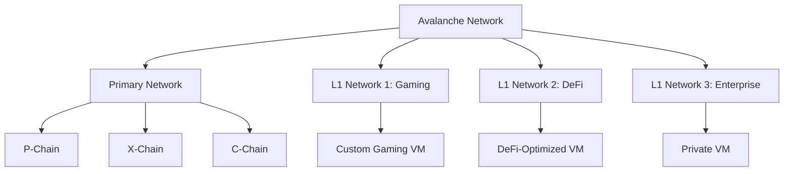

# Avalanche Introduction

## What is Avalanche?

Avalanche is a revolutionary blockchain platform designed for **high throughput**, **fast finality**, and **custom blockchain creation**. Unlike traditional blockchains, Avalanche enables the creation of unlimited custom blockchains called **Layer 1 Networks (L1s)**, formerly known as Subnets.

:::tip Real-World Example
Think of Avalanche as a **blockchain factory** where each L1 network is a specialized production line for different use cases: gaming, DeFi, enterprise applications, etc.
:::

## 🏗️ **Core Architecture**

Avalanche consists of three primary chains:

### **P-Chain (Platform Chain)**
- **Purpose**: Coordinates validators and manages L1 networks
- **Consensus**: Snowman (linear chain consensus)
- **Key Functions**:
  - Validator management and staking
  - L1 network creation and management
  - Cross-chain coordination

### **X-Chain (Exchange Chain)**
- **Purpose**: Asset creation and atomic swaps
- **Consensus**: Avalanche (DAG-based consensus)
- **Key Functions**:
  - AVAX token transfers
  - Asset creation and management
  - Cross-chain asset transfers

### **C-Chain (Contract Chain)**
- **Purpose**: Smart contracts and EVM compatibility
- **Consensus**: Snowman
- **Key Functions**:
  - Ethereum-compatible smart contracts
  - DeFi applications
  - ERC-20 token support

## ⚡ **Key Advantages**

### **1. Scalability**
- **Sub-second finality**: Transactions confirm in under 1 second
- **High TPS**: Thousands of transactions per second
- **Unlimited scaling**: Each L1 can have its own performance characteristics

### **2. Flexibility**
- **Custom VMs**: Create blockchains with custom logic
- **Configurable parameters**: Adjust gas fees, block times, etc.
- **Multiple consensus options**: Choose the best consensus for your use case

### **3. Interoperability**
- **ICM (Interchain Communication)**: Native cross-chain messaging
- **Asset transfers**: Move assets between L1s seamlessly
- **Shared security**: All L1s benefit from validator security

## 🌐 **Understanding L1 Networks**

L1 Networks (formerly Subnets) are **independent blockchains** that run on the Avalanche network:

### **Real-World L1 Examples**
- **GUNZ**: Gaming-focused blockchain for Battle Royale games
- **Beam**: Blockchain platform for seamless game integration
- **Dexalot**: Decentralized exchange with CEX-like functionality
- **Numbers Protocol**: Decentralized photo network with blockchain provenance

## 🎯 **Use Cases**

### **Gaming L1s**
- Custom tokenomics for in-game assets
- High throughput for game transactions
- Specialized VMs for gaming logic

### **DeFi L1s**
- Optimized for financial applications
- Custom fee structures
- Enhanced privacy features

### **Enterprise L1s**
- Private or permissioned networks
- Compliance-friendly features
- Integration with existing systems

## 📊 **Network Statistics**

:::info Current Ecosystem
As of 2024, the Avalanche ecosystem includes:
- **300+ L1 networks** (and growing)
- **2,000+ validators** securing the network
- **$40B+ in total value locked** across the ecosystem
- **Sub-second finality** for all transactions

*Explore real-time statistics on [Bulletin AVAX Platform →](https://bulletin-avax.vercel.app)*
:::

## 🔍 **How Bulletin AVAX Helps**

Traditional explorers show you individual transactions. **Bulletin AVAX** shows you:

- **All L1 networks** in one dashboard
- **Performance comparisons** across networks
- **ICM message tracking** between L1s
- **Validator intelligence** for staking decisions
- **Real-time analytics** for business intelligence

## 🚀 **Next Steps**

Ready to dive deeper? Continue with:

1. **[L1 Networks Guide](./l1-networks)** - Understanding Layer 1 networks
2. **[L1 Networks Guide](./l1-networks)** - Understanding Layer 1s
3. **[Try the Platform](https://bulletin-avax.vercel.app)** - Explore live data

---

*Want to see these concepts in action? Visit the [**Bulletin AVAX Platform**](https://bulletin-avax.vercel.app) and explore real-time Avalanche ecosystem data!*