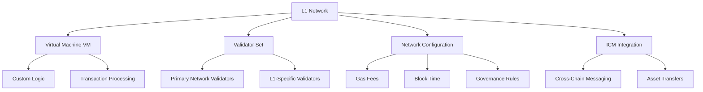

# Layer 1 Networks (L1s)

## What are L1 Networks?

**Layer 1 Networks** (formerly called Subnets) are **independent blockchains** that run on the Avalanche network. Think of them as specialized blockchain applications, each optimized for specific use cases while benefiting from Avalanche's security and interoperability.

:::tip Key Concept
**L1 ≠ Layer 2**: Unlike Layer 2 solutions that process transactions off-chain, L1 networks are full blockchains with their own consensus, validators, and state.
:::

## 🏗️ **L1 Network Architecture**

### **Components of an L1 Network**

### **1. Virtual Machine (VM)**
The VM defines how the L1 network processes transactions:

- **Subnet-EVM**: Ethereum-compatible smart contracts
- **Custom VMs**: Purpose-built for specific applications
- **WASM VMs**: WebAssembly-based virtual machines
- **Native VMs**: Built directly in Go

### **2. Validator Set**
L1 networks can have two types of validators:

- **Primary Network Validators**: Must validate the L1 + Primary Network
- **L1-Only Validators**: Only validate the specific L1 (coming soon)

### **3. Network Configuration**
Each L1 can customize:

- **Gas fee structure**: Free, fixed, or dynamic fees
- **Block time**: From 1 second to custom intervals
- **Transaction types**: What operations are allowed
- **Governance**: How network updates are decided

## 🎯 **Types of L1 Networks**

### **🎮 Gaming L1s**

**Examples**: GUNZ, Beam, Shrapnel

**Characteristics**:
- High throughput for game actions
- Custom tokenomics for in-game assets
- Low or zero fees for microtransactions
- Specialized VMs for game logic

**Use Cases**:
- In-game item trading
- Player rewards and achievements
- Tournament and competition systems
- Cross-game asset interoperability

### **💰 DeFi L1s**

**Examples**: Dexalot, Trader Joe

**Characteristics**:
- Optimized for financial operations
- Enhanced privacy features
- Custom oracle integrations
- Regulatory compliance tools

**Use Cases**:
- Decentralized exchanges
- Lending and borrowing protocols
- Derivatives and options trading
- Cross-chain DeFi protocols

### **🏢 Enterprise L1s**

**Examples**: Private networks, consortium chains

**Characteristics**:
- Permissioned or private access
- Compliance and audit features
- Integration with existing systems
- Custom governance models

**Use Cases**:
- Supply chain tracking
- Financial institution networks
- Healthcare data sharing
- Government applications

### **🎨 NFT & Media L1s**

**Examples**: Numbers Protocol

**Characteristics**:
- Optimized for media storage and transfer
- Content verification systems
- Royalty and licensing management
- High-throughput minting

**Use Cases**:
- Digital art marketplaces
- Music and video platforms
- Photography verification
- Intellectual property tracking

## 📊 **L1 Network Lifecycle**

### **Phase 1: Planning & Design**
- Define use case and requirements
- Choose virtual machine type
- Design tokenomics and governance
- Plan validator set

### **Phase 2: Development**
- Deploy VM and smart contracts
- Set up testing environment
- Create documentation and tools
- Build user interfaces

### **Phase 3: Launch**
- Register L1 on P-Chain
- Recruit initial validators
- Deploy to mainnet
- Begin operations

### **Phase 4: Growth**
- Attract users and developers
- Scale validator set
- Add new features
- Enable ICM connections

### **Phase 5: Maturity**
- Optimize performance
- Enhance security
- Expand ecosystem
- Cross-L1 integrations

## 🔍 **How to Analyze L1 Networks**

### **Key Metrics to Watch**

**Performance Metrics**:
- **TPS (Transactions Per Second)**: Network throughput
- **Block Time**: How fast blocks are produced
- **Finality Time**: How quickly transactions are final
- **Network Load**: Current usage vs capacity

**Validator Metrics**:
- **Validator Count**: Network decentralization
- **Stake Distribution**: How stake is allocated
- **Uptime**: Validator reliability
- **Geographic Distribution**: Global decentralization

**Economic Metrics**:
- **Total Value Locked (TVL)**: Assets secured
- **Transaction Volume**: Network activity
- **Gas Fees**: Cost of using the network
- **Token Distribution**: Economic decentralization

### **Using Bulletin AVAX for L1 Analysis**

:::tip Live L1 Analytics
[**Bulletin AVAX Platform**](https://bulletin-avax.vercel.app) provides real-time analysis of all L1 networks:

- **L1 Explorer**: Browse all 300+ networks
- **Performance Dashboard**: Compare TPS, block times, and load
- **Validator Intelligence**: Analyze staking opportunities
- **ICM Hub**: Track cross-L1 interactions
:::

## 🌐 **Popular L1 Networks**

### **GUNZ** 🎮
- **Focus**: Web3 gaming and Battle Royale
- **VM Type**: Gaming-optimized EVM
- **Key Features**: Low fees, high throughput
- **Website**: [gunz.dev](https://gunz.dev)

### **Beam** ⚡
- **Focus**: Gaming platform integration
- **VM Type**: EVM-compatible
- **Key Features**: Seamless blockchain integration
- **Website**: [onbeam.com](https://onbeam.com)

### **Dexalot** 💱
- **Focus**: Decentralized exchange
- **VM Type**: Trading-optimized EVM
- **Key Features**: Central limit order book
- **Website**: [dexalot.com](https://dexalot.com)

### **Numbers Protocol** 📸
- **Focus**: Decentralized photo network
- **VM Type**: Media-optimized VM
- **Key Features**: Content authenticity
- **Website**: [numbersprotocol.io](https://numbersprotocol.io)

## 🚀 **Exploring L1 Networks**

### **What You Can Do**

1. **Browse Networks**: Explore all available L1s
2. **Compare Performance**: See which networks are fastest
3. **Analyze Validators**: Find the best staking opportunities
4. **Track ICM**: Monitor cross-chain activity
5. **Investment Research**: Identify growing ecosystems

### **Getting Started**

1. **Visit [Bulletin AVAX Platform](https://bulletin-avax.vercel.app)**
2. **Browse the L1 Explorer** to see all networks
3. **Click on any network** to see detailed information
4. **Use the Performance Dashboard** to compare metrics
5. **Check the ICM Hub** for cross-chain activity

## 🔗 **Next Steps**

Ready to learn more? Continue with:

1. **[ICM & Cross-Chain](./icm)** - Learn about interoperability
2. **[Validators & Staking](./validators)** - Understand network security
3. **[Platform L1 Explorer Guide](../platform/l1-explorer)** - Master the tools

---

*Explore all L1 networks live on [**Bulletin AVAX Platform**](https://bulletin-avax.vercel.app) and see real-time data from the entire Avalanche ecosystem!*