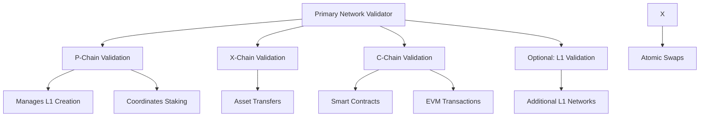

# Validators & Network Security

## Understanding Avalanche's Validator Network

**Validators** are the backbone of the Avalanche network, providing security, consensus, and decentralization. They validate transactions, produce blocks, and maintain the integrity of both the Primary Network and individual L1 networks.

:::tip Security Foundation
**Validators = Network Security**: The more validators and the more distributed their stake, the more secure and decentralized the network becomes.
:::

## 🏗️ **Validator Architecture**

### **Primary Network Validators**

Every Avalanche validator must validate the **Primary Network**, which includes:



### **L1 Network Validators**

Validators can also validate specific L1 networks:

**Validation Options**:
- **Primary Network Only**: Validate just P-Chain, X-Chain, C-Chain
- **Primary + L1s**: Validate Primary Network plus selected L1s
- **L1-Specific** (Coming Soon): Validate only specific L1s

**Current Requirements**:
```
Primary Network Validator Requirements:
• Minimum Stake: 2,000 AVAX
• Validation Period: 2 weeks to 1 year
• Uptime Requirement: >80% for rewards
• Hardware Requirements: 8 CPU, 16GB RAM, 1TB SSD

L1 Validation Additional Requirements:
• Join existing Primary Network validation
• Meet L1-specific hardware requirements
• Maintain uptime for both Primary and L1
```

## ⚡ **Staking Mechanics**

### **Validator Staking**

**Becoming a Validator**:
```typescript
Validator Setup Process:
1. Stake 2,000+ AVAX on P-Chain
2. Set validation period (2 weeks - 1 year)
3. Configure node hardware and software
4. Register for Primary Network validation
5. Optionally join L1 network validation
```

**Validator Rewards**:
- **Base Rewards**: From validating Primary Network
- **L1 Rewards**: Additional rewards from L1 networks
- **Delegation Rewards**: Fee sharing from delegators
- **Uptime Bonuses**: Extra rewards for high availability

### **Delegation Mechanics**

**For Non-Validators**:
```typescript
Delegation Process:
1. Choose a validator to delegate to
2. Stake AVAX to that validator
3. Set delegation period (2 weeks - 1 year)
4. Earn rewards based on validator performance

Delegation Benefits:
• Lower minimum: 25 AVAX vs 2,000 AVAX
• No hardware requirements
• Share in validator rewards
• Maintain liquidity at delegation end
```

**Reward Distribution**:
```
Validator Reward Split:
┌─────────────────────────────────────────────────────┐
│ Total Network Rewards: 100%                        │
├─────────────────────────────────────────────────────┤
│ Validator Portion: 10-20% (set by validator)       │
│ Delegator Portion: 80-90% (shared among delegators)│
└─────────────────────────────────────────────────────┘
```

## 🔍 **Validator Selection Criteria**

### **Performance Metrics**

**Uptime Analysis**:
```
Validator Uptime Categories:
🟢 Excellent (>98%):  Highly reliable, maximum rewards
🟡 Good (95-98%):     Reliable, near-maximum rewards
🟠 Moderate (80-95%): Some missed rewards
🔴 Poor (<80%):       Significant reward penalties
```

**Capacity Management**:
```
Delegation Capacity Status:
✅ Available:   Accepting new delegations
⚠️ Limited:     Near capacity, limited slots
❌ Full:        Not accepting new delegations
🔄 Rotating:    Periodic capacity openings
```

### **Risk Assessment Factors**

**Validator Reliability**:
- **Historical Uptime**: Track record over multiple validation periods
- **Hardware Stability**: Consistent performance indicators
- **Geographic Diversity**: Reduces correlated failure risks
- **Operational Experience**: Team experience and reputation

**Stake Distribution**:
```
Healthy Stake Distribution:
┌─────────────────────────────────────────────────────┐
│ Self-Stake:     ████████ 20-40% (skin in the game) │
│ Large Delegators: ████ 10-20% (institutional)      │
│ Small Delegators: ████████████ 40-70% (retail)     │
└─────────────────────────────────────────────────────┘

Risk Indicators:
🔴 Over-concentrated: >70% from single source
🟠 Imbalanced: <10% self-stake
🟡 Moderate: Some concentration risks
🟢 Well-distributed: Healthy stake spread
```

## 🌐 **L1 Network Validator Dynamics**

### **Multi-Network Validation**

**Popular L1 Validation Combinations**:
```
High-Reward Combinations:
1. Primary Network + GUNZ + Beam (Gaming focus)
2. Primary Network + Dexalot + TraderJoe (DeFi focus)
3. Primary Network + Numbers + Media L1s (Content focus)
4. Primary Network + Enterprise L1s (B2B focus)
```

**Validation Strategy Considerations**:
- **Reward Potential**: L1s with higher activity = higher rewards
- **Hardware Requirements**: More L1s = more computational needs
- **Market Focus**: Specializing in specific L1 categories
- **Risk Diversification**: Spreading across multiple L1 types

### **L1-Specific Requirements**

**Gaming L1 Validation**:
```
Additional Requirements:
• Higher CPU for game transaction processing
• Low-latency networking for real-time gaming
• Specialized gaming VM understanding
• Community engagement in gaming ecosystems
```

**DeFi L1 Validation**:
```
Additional Requirements:
• Financial protocol expertise
• High availability for trading operations
• MEV protection capabilities
• Regulatory compliance awareness
```

**Enterprise L1 Validation**:
```
Additional Requirements:
• Enhanced security measures
• Compliance and audit capabilities
• Enterprise SLA commitments
• Private network access management
```

## 📊 **Validator Economics**

### **Reward Calculations**

**Annual Percentage Yield (APY)**:
```typescript
APY Calculation Components:
Base APY = (Annual Network Rewards / Total Staked) * 100
Validator APY = Base APY + L1 Bonuses + Uptime Bonuses - Fees

Typical APY Ranges:
• Primary Network Only: 8-12% APY
• Primary + Popular L1s: 12-18% APY
• Primary + Multiple L1s: 15-25% APY
• Varies by network activity and competition
```

**Reward Distribution Timeline**:
```
Reward Schedule:
┌─────────────────────────────────────────────────────┐
│ Validation Period:  [████████████████████████████] │
│                                                     │
│ Rewards Accrued:   Daily during validation         │
│ Rewards Paid:      At END of validation period     │
│ Stake Returned:    At END of validation period     │
└─────────────────────────────────────────────────────┘

Important: No rewards or stake access during validation!
```

### **Cost-Benefit Analysis**

**Validator Operating Costs**:
```
Monthly Operating Expenses:
• Hardware/Cloud: $200-800/month
• Electricity: $50-200/month
• Internet: $50-100/month
• Monitoring/Tools: $20-100/month
• Total: $320-1,200/month

Break-even Analysis:
Minimum viable stake for profitability:
• Low-cost setup: ~5,000 AVAX
• High-performance setup: ~15,000 AVAX
• Enterprise setup: ~50,000 AVAX
```

**Delegation vs. Validation**:
```
Delegation Benefits:
✅ No hardware costs
✅ No technical expertise needed
✅ Lower minimum stake (25 AVAX)
✅ No operational responsibilities

Validation Benefits:
✅ Higher potential returns
✅ Keep 100% of own rewards
✅ Control over L1 selection
✅ Network governance participation
```

## 🛡️ **Security Considerations**

### **Network Security Model**

**Byzantine Fault Tolerance**:
```
Security Guarantees:
• Safe with >67% honest stake
• Consensus breaks with >33% malicious stake
• Economic incentives align with honest behavior
• Slashing penalties for malicious actions
```

**Validator Slashing Conditions**:
```
Slashing Scenarios:
🔴 Double-spending attempts
🔴 Consensus rule violations
🔴 Coordinated attacks
🔴 Long-term downtime (>2 weeks)

Penalties:
• Validation rewards forfeited
• Potential stake reduction
• Removal from validator set
• Reputation damage
```

### **Operational Security**

**Validator Security Best Practices**:
```typescript
Security Checklist:
✅ Secure key management (hardware security modules)
✅ Network isolation and firewalls
✅ Regular software updates
✅ Monitoring and alerting systems
✅ Backup and disaster recovery
✅ Geographic distribution (if multiple nodes)
✅ Secure communication channels
✅ Regular security audits
```

**Common Attack Vectors**:
- **Key Compromise**: Securing validator private keys
- **DDoS Attacks**: Network availability protection
- **Social Engineering**: Team security awareness
- **Infrastructure Failures**: Redundancy and monitoring

## 🔍 **Using Bulletin AVAX for Validator Analysis**

### **Validator Intelligence Features**

**Comprehensive Validator Analytics**:
```
Available Metrics:
📊 Performance History
  • Uptime trends over time
  • Reward consistency analysis
  • L1 participation tracking

📈 Capacity Analysis
  • Current delegation slots
  • Historical capacity utilization
  • Future availability predictions

🎯 Risk Assessment
  • Stake concentration analysis
  • Geographic risk factors
  • Performance volatility metrics

💰 Reward Optimization
  • Expected return calculations
  • Comparative yield analysis
  • Risk-adjusted return scores
```

### **Delegation Strategy Tools**

**Portfolio Optimization**:
```typescript
Delegation Strategy Builder:
1. Risk Tolerance: Conservative | Balanced | Aggressive
2. Stake Amount: 25 - 1,000,000 AVAX
3. Diversification: Single | Multiple | Portfolio
4. L1 Focus: All | Gaming | DeFi | Enterprise | Specific

Output:
• Recommended validator mix
• Expected portfolio returns
• Risk assessment summary
• Monitoring recommendations
```

**Real-Time Opportunities**:
- **New Validator Discovery**: Find promising new validators
- **Capacity Alerts**: Notification when preferred validators have space
- **Performance Alerts**: Monitor your delegated validators
- **Yield Optimization**: Suggestions for improving returns

:::tip Validator Intelligence
Use [**Bulletin AVAX Validator Intelligence**](https://bulletin-avax.vercel.app) to analyze all validators across the ecosystem and optimize your staking strategy.
:::

## 🚀 **Getting Started with Validation/Delegation**

### **For Delegators**

**Step 1: Research Validators**
```javascript
Research Checklist:
1. Check validator uptime history (>95% recommended)
2. Analyze fee structure (5-20% typical)
3. Review stake distribution (avoid over-concentration)
4. Assess L1 participation (gaming, DeFi, etc.)
5. Verify delegation capacity availability
```

**Step 2: Risk Assessment**
```javascript
Risk Factors:
• Validator Concentration: Spread across 3-5 validators
• Geographic Diversity: Choose validators in different regions
• L1 Exposure: Balance between stable and growth L1s
• Validation Period: Consider 2 weeks to 1 year lockup
```

**Step 3: Execute Delegation**
```javascript
Delegation Process:
1. Use Avalanche Wallet or Core
2. Navigate to "Stake" section
3. Choose validator and amount
4. Set delegation period
5. Confirm transaction
6. Monitor performance via Bulletin AVAX
```

### **For Aspiring Validators**

**Preparation Phase**:
```typescript
Pre-Validation Checklist:
✅ Accumulate 2,000+ AVAX
✅ Research hardware requirements
✅ Understand operational commitments
✅ Plan for validation period length
✅ Consider L1 validation opportunities
✅ Set up monitoring and alerting
```

**Technical Setup**:
```typescript
Infrastructure Requirements:
• AvalancheGo node software
• Proper hardware specifications
• Reliable internet connection
• Monitoring and alerting systems
• Backup and disaster recovery
• Security hardening measures
```

**Operational Considerations**:
```typescript
Ongoing Responsibilities:
• Maintain >80% uptime
• Keep software updated
• Monitor network health
• Respond to alerts quickly
• Maintain hardware/systems
• Engage with community
```

## 🔗 **Next Steps**

Ready to participate in Avalanche validation?

1. **[Staking Mechanics Deep Dive](./staking-mechanics)** - Technical staking details
2. **[Delegation Strategies](./delegation)** - Optimize your delegation approach
3. **[Validator Intelligence Guide](../platform/validators)** - Master the analysis tools
4. **[Visit Validator Intelligence](https://bulletin-avax.vercel.app)** - Analyze all validators

---

*Secure the Avalanche network while earning rewards. Explore all validator opportunities on [**Bulletin AVAX Platform**](https://bulletin-avax.vercel.app) and make informed staking decisions!*